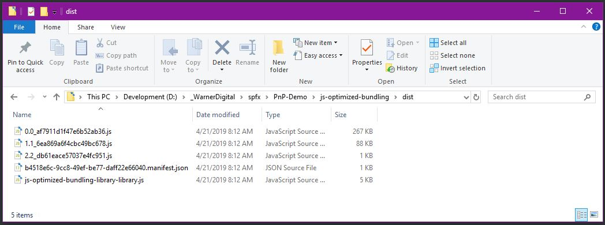

# Optimized Bundling

## Summary

This sample illustrates how 3rd party libraries or custom functionality can be optimized and bundled into separate .js bundle files.

Each optimized and separate bundle can be used by a web part or extension and imported individually. 

This provides the opportunity to include organized collections of functionality into a single Library Component without the need to load the entire Library Component on a SharePoint page when only one single piece of functionality from the Library Component is needed.

This sample shows how jQuery, Moment.js and additional custom functionality can be included in the Library, but optimized to be performance friendly at runtime by only loading the desired functionality from the library.

### Optimized Bundle Results
As you can see below, the three pieces of functionality (jQuery, Moment.js and custom functions) have been separated into multiple javascript bundles, each individually importable at runtime into a web part or extension.



### Code Sample for asynchronous importing of the Library Component into a web part or extension

- Follow the directions found here to create an NPM Link to the library:<BR>
https://docs.microsoft.com/en-us/sharepoint/dev/spfx/library-component-tutorial

- Add an import to refer to the library
```
import * as optimizedLibrary from 'js-optimized-bundling'
```

- Use the following code to import the functionality in the 'ImportCustomFunctions.ts' file.
```
const myLibraryInstance = new optimizedLibrary.JsOptimizedBundlingLibraryLibrary();
    myLibraryInstance.dynamicallyImportCustomFunctions().then((objCustomFunctions) => {
        objCustomFunctions.default.welcomeAlert();
        objCustomFunctions.default.welcomeConsole();
    });
```

## Used SharePoint Framework Version 


## Applies to

* [SharePoint Framework](https://dev.office.com/sharepoint)
* [Office 365 tenant](https://dev.office.com/sharepoint/docs/spfx/set-up-your-development-environment)


## Prerequisites

> N/A

## Solution

Solution|Author(s)
--------|---------
js-optimized-bundling | David Warner II ([@DavidWarnerII](https://twitter.com/davidwarnerii) / [Warner Digital](http://warner.digital))
js-optimized-bundling | Beau Cameron ([@Beau__Cameron](https://https://twitter.com/Beau__Cameron) / [https://beaucameron.net/](https://beaucameron.net/))

## Version history

Version|Date|Comments
-------|----|--------
1.0|April 24, 2019|Initial release

## Disclaimer
**THIS CODE IS PROVIDED *AS IS* WITHOUT WARRANTY OF ANY KIND, EITHER EXPRESS OR IMPLIED, INCLUDING ANY IMPLIED WARRANTIES OF FITNESS FOR A PARTICULAR PURPOSE, MERCHANTABILITY, OR NON-INFRINGEMENT.**

---

## Minimal Path to Awesome

- Clone this repository
- in the command line run:
  - `npm install`
  - `gulp serve`

## Features
This library component illustrates the following concepts:

- Optmize the bundling of Library Functionality into separate files
  - Including one or more 3rd party JS Libraries
  - Including custom functionality
  


