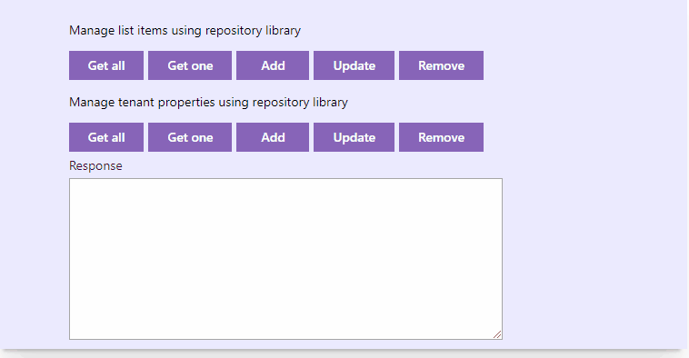

# Repository Library

## Summary
This sample shows how you can use repository pattern to separate the logic that retrieves the data from SharePoint and maps it to the entity model from the business logic that acts on the model. This library then can be shared across all of your web parts and extensions.

The separation between the data and business tiers has three benefits:

* It centralizes the data logic or Web service access logic.
* It provides a substitution point for the unit tests.
* It provides a flexible architecture that can be adapted as the overall design of - the application evolves.

It's just a basic implementation to show you how to centralize your data access needs, you can extend this library like including search api to have advanced queries, caching etc.

This sample consists of two repositories:
* SharePoint repository to manage CRUD operations on SharePoint lists and libraries
* Tenant repository to manage CRUD opetrations on tenant properties (requires global admin permission)

For more information please [read this post](https://raminahmadi.co.uk/?p=138).



## Used SharePoint Framework Version 


## Applies to

* [SharePoint Framework](https://dev.office.com/sharepoint)
* [Office 365 tenant](https://dev.office.com/sharepoint/docs/spfx/set-up-your-development-environment)

## Solution

Solution|Author(s)
--------|---------
ts-repository-library | Ramin Ahmadi

## Version history

Version|Date|Comments
-------|----|--------
1.0|August 16, 2019|Initial release

## Disclaimer
**THIS CODE IS PROVIDED *AS IS* WITHOUT WARRANTY OF ANY KIND, EITHER EXPRESS OR IMPLIED, INCLUDING ANY IMPLIED WARRANTIES OF FITNESS FOR A PARTICULAR PURPOSE, MERCHANTABILITY, OR NON-INFRINGEMENT.**

---

## Minimal Path to Awesome

- Clone this repository
- in the command line run:
  - `npm install`
  - `npm link`
  - `gulp serve`

Web part or extension solution:
- `npm link ts-repository-library`
- import the repositories:
```
import * as Repository from "ts-repository-library";
```
- SharePoint repository usage:
```
interface IMySampleListItem{
    Id:number;
    Title:string;
    Active:boolean;
}
// list Id, you can get list id through web part properties and pass it as a parameter
const listId = "f9c88fb5-3bbc-4f2b-b45c-f31e63e260bd";

// instanciate the repository class
const mySampleList = new Repository.SharePointRepository<IMySampleListItem>(listId);

// get all items
const items = await mySampleList.getAll();

// get item by id
const item = await mySampleList.getOne(1);

// add new item
await mySampleList.add({
    Title:"My New Segment",
    Active: true
});
// update an existing item
await mySampleList.update({
  Id:1,
  Title:"Item has been updated",
  Active: false
});
// remove item
await mySampleList.delete(2);

- Tenant properties repository
// you need to pass the web part or extension context
const tenantRepository = new Repository.TenantRepository(this.props.spfxContext);

// get all properties
const properties = await tenantRepository.getAll();

// get property by key
const property = await tenantRepository.getOne("MyApplicationProperty");

// add new property
await tenantRepository.add({
    key:"MyApplicationProperty",
    Value:"OfficePnPDev"
});

// update property
await tenantRepository.update({
    key:"MyApplicationProperty",
    Value: "New Value",
    Comment:"My Comments"
});
// remove property
await tenantRepository.delete("MyApplicationProperty");
```
